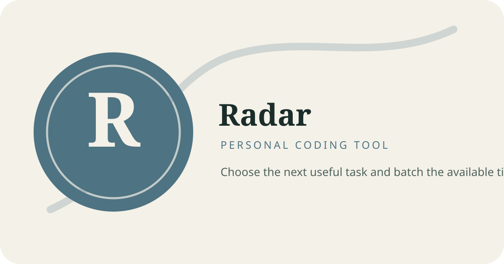

# Radar



Read-only planning aide for choosing the next task, batching related work, and protecting warm context.

## Install

```sh
./scripts/install.sh
```

The backup-aware installer writes the Claude command `/radar`, the Codex skill `$radar`, and the custom agent definitions. Existing differing files are preserved under `~/.local/state/personal-tools/backups/radar/<timestamp>/`.

## Use

- Claude: `/radar <natural-language request>`
- Codex: mention the request naturally or invoke `$radar`

Radar reads current project state before advising and stops when required reads fail.

## Documentation

- [Configuration](docs/configuration.md)
- [Permissions](docs/permissions.md)
- [Troubleshooting](docs/troubleshooting.md)
- [Examples](examples/README.md)

## Development

```sh
sh tests/install.sh
```

## Release history

See [CHANGELOG.md](CHANGELOG.md).

## License

MIT. See [LICENSE](LICENSE).
